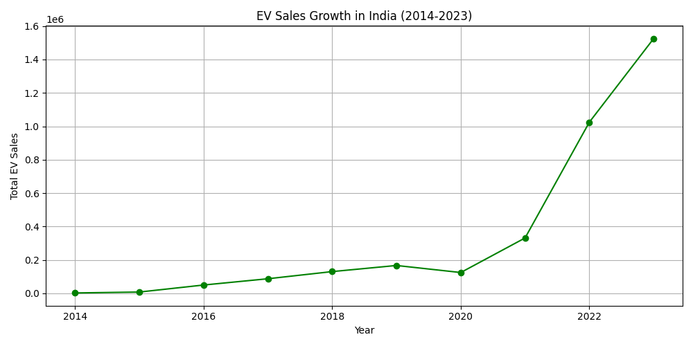
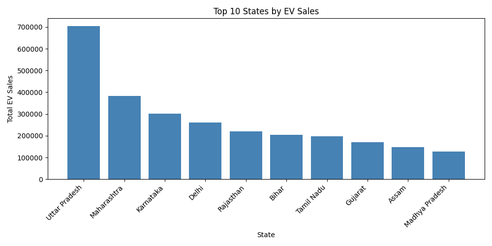
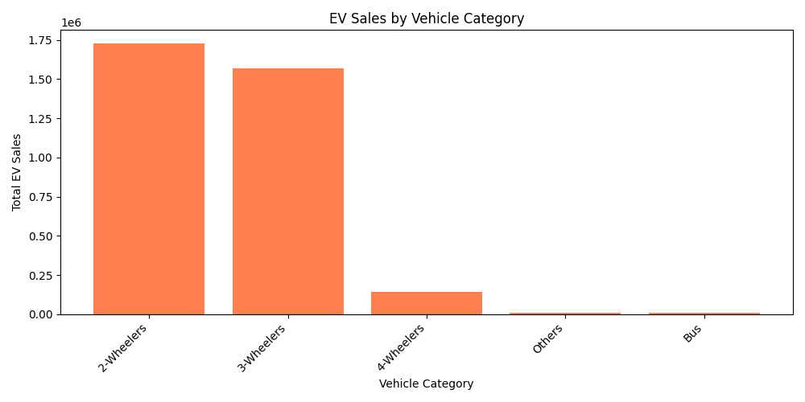

# EV Adoption Trends in India (2014–2024)

A data analysis project exploring electric vehicle (EV) sales trends across India using VAHAN Ministry data. The project covers state-wise, category-wise, and year-wise EV adoption patterns to identify growth trends and regional insights.

---

## Project Overview

India's EV market has seen explosive growth — from near-zero registrations in 2014 to over 1.5 million units in 2023. This project analyses **96,845 records** spanning **34 states** and **10 years** to uncover what's driving this shift.

### Key Questions Answered
- How has EV sales volume grown year over year from 2014 to 2024?
- Which states are leading EV adoption in India?
- Which vehicle categories (2-wheelers, 3-wheelers, 4-wheelers) dominate the market?

---

## Dataset

| File | Description |
|------|-------------|
| `data/EV_Dataset.csv` | Raw VAHAN Ministry data — 96,845 rows, 8 columns |
| `data/Dataset.xlsx` | Excel version of the raw dataset |
| `data/EV_Summary.xlsx` | Aggregated year-wise EV sales summary |

**Columns:** `Year`, `Month_Name`, `Date`, `State`, `Vehicle_Class`, `Vehicle_Category`, `Vehicle_Type`, `EV_Sales_Quantity`

**Source:** [VAHAN Ministry of Road Transport & Highways](https://vahan.parivahan.gov.in/vahan4dashboard/)

---

## Key Findings

- **10x growth** in EV sales between 2021 and 2023, with 2023 crossing the 1.5 million mark
- **Uttar Pradesh** leads all states with ~700,000 total EV sales, followed by Maharashtra and Karnataka
- **2-Wheelers and 3-Wheelers** dominate the market — together accounting for over 95% of all EV sales
- **4-Wheeler EVs** remain a small but growing segment, reflecting price sensitivity in the Indian market
- A notable **dip in 2020** aligns with COVID-19 pandemic disruptions

---

## Charts

### EV Sales Growth by Year


### Top 10 States by EV Sales


### EV Sales by Vehicle Category


---

## Tech Stack

| Tool | Usage |
|------|-------|
| Python 3 | Data processing and analysis |
| pandas | Data aggregation and groupby operations |
| matplotlib | Chart generation |
| Excel / Power BI | Dashboard and summary reporting |

---

## How to Run

1. Clone the repository:
   ```bash
   git clone https://github.com/YOUR_USERNAME/ev-adoption-india.git
   cd ev-adoption-india
   ```

2. Install dependencies:
   ```bash
   pip install pandas matplotlib openpyxl
   ```

3. Run the analysis:
   ```bash
   python analysis.py
   ```

This will generate the three charts and export `EV_Summary.xlsx`.

---

## Project Structure

```
ev-adoption-india/
├── analysis.py          # Main analysis script
├── README.md            # Project documentation
├── data/
│   ├── EV_Dataset.csv   # Raw dataset (VAHAN)
│   ├── Dataset.xlsx     # Excel version of raw data
│   └── EV_Summary.xlsx  # Year-wise aggregated summary
└── charts/
    ├── yearly_sales.png  # EV sales growth trend
    ├── state_sales.png   # Top 10 states bar chart
    └── category_sales.png# Vehicle category breakdown
```

---

## About

Built as part of a data analytics portfolio focused on the Indian automotive and EV sector. This project demonstrates skills in data wrangling, exploratory data analysis, and business insight generation from government datasets.

**Author:** Subrat Panda  
**LinkedIn:** https://www.linkedin.com/in/subrat-panda-234315410/
